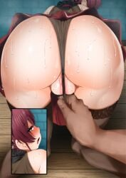

# NSFW AI Art Generator (18+)

---

⚠️ **ПОПЕРЕДЖЕННЯ: Вміст для дорослих** ⚠️

Цей репозиторій містить код для генерації візуального контенту, призначеного виключно для осіб старше 18 років. Програмне забезпечення може створювати зображення відвертого характеру. Відповідальність за використання покладається на користувача.

---

## Опис Проєкту

Цей проєкт є бекенд-сервісом для генерації зображень за допомогою моделі штучного інтелекту (AI), спеціалізованої на контенті для дорослих (NSFW). Сервіс побудований на асинхронному фреймворку [FastAPI](fastapi.tiangolo.com), використовує Python 3.11+ та повністю контейнеризований за допомогою Docker для легкого розгортання.

### Ключові технології:

*   **Python:** РУКИ РОЗРОБНИКА І ТРОХИ RUL#$

## Початок роботи

КЛОНУЙТЕ РЕПОЗИТОРІЙ І ПРОСТО НАСОЛОДЖУЙТЕСЯ(запускати не потрібно, все автоматизовано)

